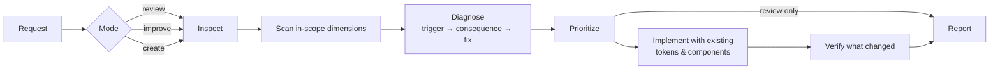

<p align="center">
  
</p>

<p align="center">
  <a href="LICENSE"></a>
  
  
  
</p>

**Interface Craft** is an [agent skill](https://docs.claude.com/en/docs/claude-code/skills) that turns your coding agent into a careful product-design reviewer. When you ask it to *"review this screen"*, *"make this form better"* or *"fix the empty states"*, it doesn't just add shadows. It checks whether the user can finish the task, understand the copy, recover from errors, and use the interface with a keyboard or screen reader. Then it polishes the details, using your existing design system.

It combines five bodies of practice in one skill, with rules for which one wins when they conflict:

- **Nielsen's 10 usability heuristics**: status, control, error prevention, recovery
- **Laws of UX**: Fitts, Hick, Jakob, Miller, goal-gradient and others, used as decision aids rather than dogma
- **UX writing**: labels, errors, empty states, confirmations, localization
- **Accessibility**: WCAG 2.2 AA thresholds, keyboard, focus, screen readers, reduced motion
- **Visual craft**: concrete values for radius, shadows, typography and motion, adapted from [make-interfaces-feel-better](https://github.com/jakubkrehel/make-interfaces-feel-better)

---

## Contents

- [Before and after](#before-and-after)
- [What the agent reports](#what-the-agent-reports)
- [How it works](#how-it-works)
- [What it pays attention to](#what-it-pays-attention-to)
- [What it will not do](#what-it-will-not-do)
- [Install](#install)
- [Usage](#usage)
- [Repository layout](#repository-layout)
- [Credits and license](#credits-and-license)

---

## Before and after

These mockups show the kind of changes the skill proposes. Their HTML sources are in [`examples/`](examples).

### 1. Forms: labels, errors, pending state, targets


> **Why:** a placeholder disappears as soon as the user types. “Invalid input” gives the user nothing to act on. A button that stays tappable while a request is pending invites repeat submits. The skill fixes each of these and states the limits of its fix: disabling the button reduces duplicate taps, but only the backend can guarantee idempotency.

### 2. Destructive actions: scope, consequence, undo


> **Why:** routine “Are you sure?” dialogs teach people to click through. The skill asks what exactly will happen, names the button after the action, and uses Undo instead of a confirmation when the action can be reversed.

### 3. System states: empty is not the same as failed


> **Why:** a network error that looks like an empty account makes users think their data is gone. The skill separates *initial*, *no results*, *failed*, *loading*, *partial* and *success* states, and gives each one its own next step.

### 4. Honest, trust-sensitive copy


> **Why:** dark patterns may convert once and cost trust afterwards. The skill never adds false urgency, hidden costs or guilt-based opt-outs, and it flags them when it finds them.

### 5. Visual craft: the details on top


> **Why:** these details only matter once the basics above work, which is why polish comes last in the skill's priority order. The values (radius math, three-layer shadow, `tabular-nums`, `scale(0.96)` on press, and so on) are **starting defaults**. Your design tokens and what the rendered result looks like take precedence.

---

## What the agent reports

For a broad review, the agent gives a short summary first and then one table sorted by priority. Here is a trimmed example of a sign-up form review:

| # | Priority | Location | Before | After | User impact |
|---|---|---|---|---|---|
| 1 | Blocker | `SignUp.tsx:42` | Submit stays enabled while pending; repeated taps send repeated requests | Disable during request, spinner + “Creating account…” | Fewer repeat submissions, visible status. *Not verified: backend idempotency, flagged for follow-up* |
| 2 | A11y | `SignUp.tsx:18` | Email field has a placeholder only | Persistent `<label>` “Email”; placeholder is an example | Label stays visible while typing; screen readers announce it |
| 3 | Error | `validation.ts:9` | “Invalid input” | “Use at least 8 characters. You have 6.” next to the field | The user knows exactly what to fix |
| 4 | Polish | `Card.tsx:7` | `rounded-xl` on the card and on the inner button with `p-2` | Card `rounded-2xl` (8 + 8), button `rounded-lg` | Nested corners look concentric |

It then lists the **checks it actually ran** (browser preview, keyboard pass, both themes, and so on) and what it could not verify. Dimensions with nothing to report are left out; the table is never padded.

---

## How it works



1. **Mode is inferred:** *review* (report only), *improve* (fix and verify) or *create* (build it right from the start). You don't pick from a menu.
2. **Scope follows the request.** A broad “review this screen” scans all seven dimensions. A narrow “only the microcopy” checks only that dimension plus whatever the change directly affects, such as a longer label still fitting.
3. **Every finding is evidence-based:** what was observed, what it costs the user, and a concrete fix. Hypotheses are labeled as hypotheses. The skill never claims conversion gains or user testing it didn't do.
4. **Fixed priority order:**
   1. Task blockers and accessibility
   2. Errors, ambiguity and decision burden
   3. Wording, hierarchy and consistency
   4. Decorative polish
5. **Conflict resolution:** `user intent > accessibility > platform conventions > existing design system > aesthetics`.
6. **Proportional verification:** narrow and wide layouts, long text and both themes for visual work; keyboard, focus, loading, error and recovery for interaction work.

---

## What it pays attention to

<table>
<tr><th>Dimension</th><th>Examples of what it looks for</th></tr>
<tr><td><b>Task flow</b></td><td>Can the user start, continue, finish and recover? Is anything essential (price, consequence, a required field) hidden behind progressive disclosure?</td></tr>
<tr><td><b>Information & decision load</b></td><td>Too many equally loud options, missing defaults, information the user must remember from a previous screen</td></tr>
<tr><td><b>Microcopy</b></td><td>Vague buttons (“OK”, “Submit”), errors without a fix, placeholder-as-label, inconsistent terms, concatenated strings that break in translation</td></tr>
<tr><td><b>Interaction</b></td><td>Hover-only actions, missing pressed/selected/disabled states, nested click targets, no undo, duplicate submits</td></tr>
<tr><td><b>System states</b></td><td>Empty vs no-results vs failed vs loading vs partial; success claimed before it is confirmed; lost input after an error</td></tr>
<tr><td><b>Accessibility</b></td><td>Contrast (4.5:1 text, 3:1 non-text), target size, focus order and visibility, modal focus trap and return, labels and errors linked to fields, reduced motion, screen-reader names</td></tr>
<tr><td><b>Visual craft</b></td><td>Concentric radius, layered shadows vs borders, tabular numbers, optical alignment, text wrapping, interruptible motion, <code>transition: all</code>, layout shift</td></tr>
</table>

<details>
<summary><b>Laws of UX: how they're used</b></summary>

<br>

Each principle is written as *symptom → fix → what not to do*, for example:

| Principle | Symptom → fix | Don't |
|---|---|---|
| Fitts's law | Small or distant targets → bigger targets, primary action near the task | Let enlarged targets overlap |
| Hick's law | Stalled decisions → clearer categories, a sensible default | Delete useful options just to lower the count |
| Miller's law | Remembering across screens → chunk info, keep context visible | Cap menus at “7±2” items |
| Goal-gradient | Long flows feel endless → truthful step indicator | Fake progress |
| Doherty threshold | Actions feel unresponsive → instant pressed state, honest pending state | Add artificial delay |

See [`cognitive-principles.md`](skills/interface-craft/references/cognitive-principles.md) for the full list.
</details>

<details>
<summary><b>Web and native platforms</b></summary>

<br>

The visual reference includes native equivalents, so the skill is useful beyond CSS:

| Technique | Web | SwiftUI | Compose |
|---|---|---|---|
| Tabular numbers | `font-variant-numeric: tabular-nums` | `.monospacedDigit()` | `fontFeatureSettings = "tnum"` |
| Press feedback | `active:scale-[0.96]` | `ButtonStyle` + `.scaleEffect` | `animateFloatAsState` |
| Hit area | pseudo-element to 40–44px | `.frame(minWidth: 44, minHeight: 44)` | `minimumInteractiveComponentSize()` |
| Reduced motion | `prefers-reduced-motion` | `accessibilityReduceMotion` | animator duration scale |

Before using newer platform APIs, the skill checks your deployment target and dependency versions, and falls back to compatible alternatives when needed.
</details>

<details>
<summary><b>Localization, including Turkish</b></summary>

<br>

The microcopy reference covers locale formatting (`₺1.234,50`), plural rules and text expansion, plus Turkish-specific pitfalls: `i/İ` and `ı/I` casing, vowel-harmony suffixes on dynamic values, and consistent *sen/siz* address. The agent keeps the interface's existing locale and replies in your language.
</details>

---

## What it will not do

- Fake progress, invent urgency, hide costs, or write guilt-trip opt-outs
- Replace labels with placeholders, or make actions hover-only
- Cap menus at “seven items” or delete options just to reduce the count
- Animate everything, or add a motion library just for polish
- Trade readability, discoverability, control or accessibility for decoration
- Change product claims, prices or business behavior unless that's in scope
- Claim a check it did not run, or present an expert review as user research

---

## Install

### Claude Code: plugin (recommended)

```bash
/plugin marketplace add harun-yardimci/interface-craft
/plugin install interface-craft@interface-craft
```

### Claude Code: manual

```bash
git clone https://github.com/harun-yardimci/interface-craft.git
cp -R interface-craft/skills/interface-craft ~/.claude/skills/
```

To install it for a single project, copy it to `.claude/skills/` in that repo instead.

### OpenAI Codex

```bash
git clone https://github.com/harun-yardimci/interface-craft.git
cp -R interface-craft/skills/interface-craft ~/.agents/skills/
```

For a single project, use `.agents/skills/`. The optional `agents/openai.yaml` sets the display name and default prompt in the Codex UI.

### Claude apps

Download `interface-craft.zip` from the [latest release](https://github.com/harun-yardimci/interface-craft/releases/latest) and upload it under **Settings → Capabilities → Skills**.

---

## Usage

The skill triggers automatically on broad interface requests. You can also call it directly:

```text
/interface-craft review the checkout flow in app/checkout, review only
/interface-craft improve the onboarding screens, keep the layout
/interface-craft only fix the error and empty states on the invoices page
Bu ekranı incele, önce/sonra tablo ile raporla
```

For narrow tasks it steps aside when a more specific skill is installed. For example, it defers to a dedicated UX-writing skill for copy-only work or an accessibility-audit skill for a WCAG audit. When no such skill is installed, it handles the task with only the relevant reference.

---

## Repository layout

```text
skills/interface-craft/
├── SKILL.md                         # workflow, routing, hard rules, output format
├── agents/openai.yaml               # optional Codex UI metadata
└── references/                      # loaded only when the task needs them
    ├── interaction-and-feedback.md  # Nielsen's 10 heuristics, flows, states, recovery
    ├── cognitive-principles.md      # Laws of UX as decision aids
    ├── microcopy.md                 # patterns, before → after, localization
    ├── accessibility.md             # WCAG 2.2 AA thresholds and checks
    └── visual-craft.md              # concrete values + SwiftUI/Compose equivalents
.claude-plugin/                      # Claude Code plugin + marketplace manifests
examples/                            # HTML sources of the README mockups
assets/                              # rendered images
```

The skill uses progressive disclosure: `SKILL.md` stays small, and each reference file is loaded only when the task needs it.

---

## Contributing

Issues and PRs are welcome, especially:

- **Real before/after cases** where the skill helped, or where it got something wrong
- **Platform coverage**: Flutter, React Native, UIKit specifics
- **Localization notes** for other languages

Please keep additions evidence-based and concrete. A new rule should name the problem it solves and its limits.

---

## Credits and license

- Visual craft values are adapted from [**make-interfaces-feel-better**](https://github.com/jakubkrehel/make-interfaces-feel-better) by Jakub Krehel (MIT). See [NOTICE](NOTICE).
- Heuristics: Jakob Nielsen, [10 Usability Heuristics for User Interface Design](https://www.nngroup.com/articles/ten-usability-heuristics/). Only the heuristic names are used; the guidance is original.
- Laws of UX: Jon Yablonski, [lawsofux.com](https://lawsofux.com/). Principle names link to the source; the guidance is original.
- Accessibility thresholds reference [WCAG 2.2](https://www.w3.org/TR/WCAG22/).

Released under the [MIT License](LICENSE) © 2026 Harun Yardimci.
