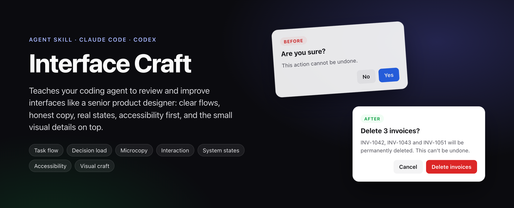
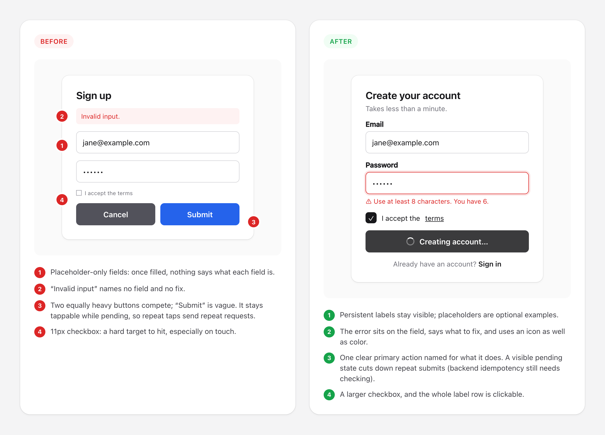
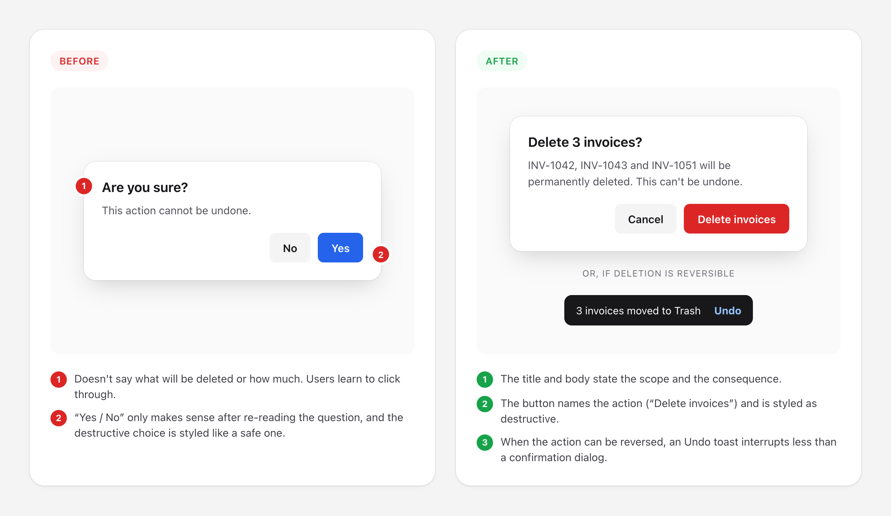
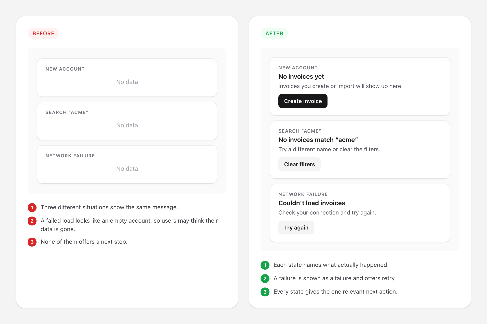
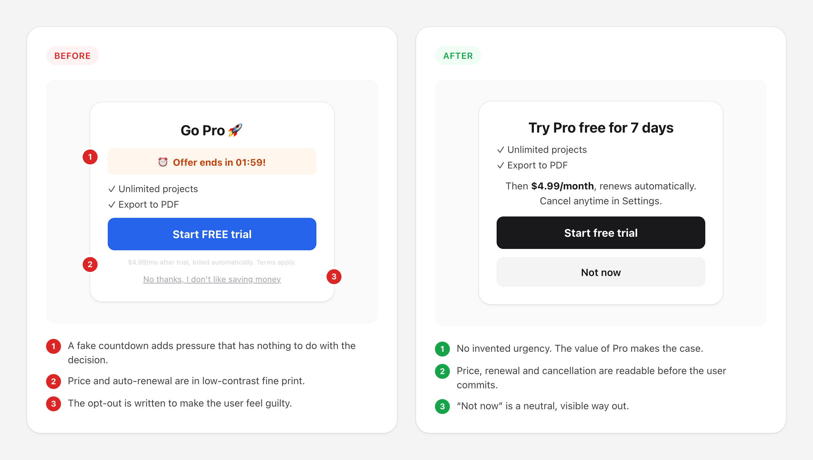
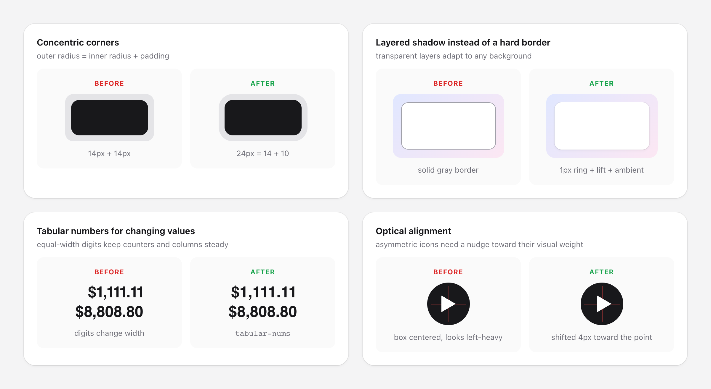
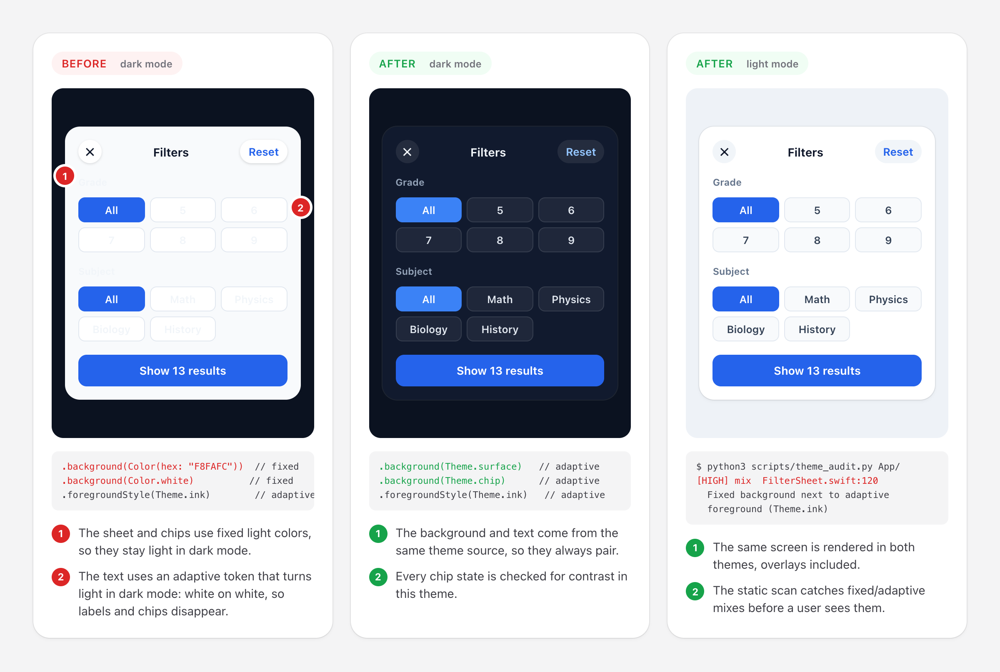
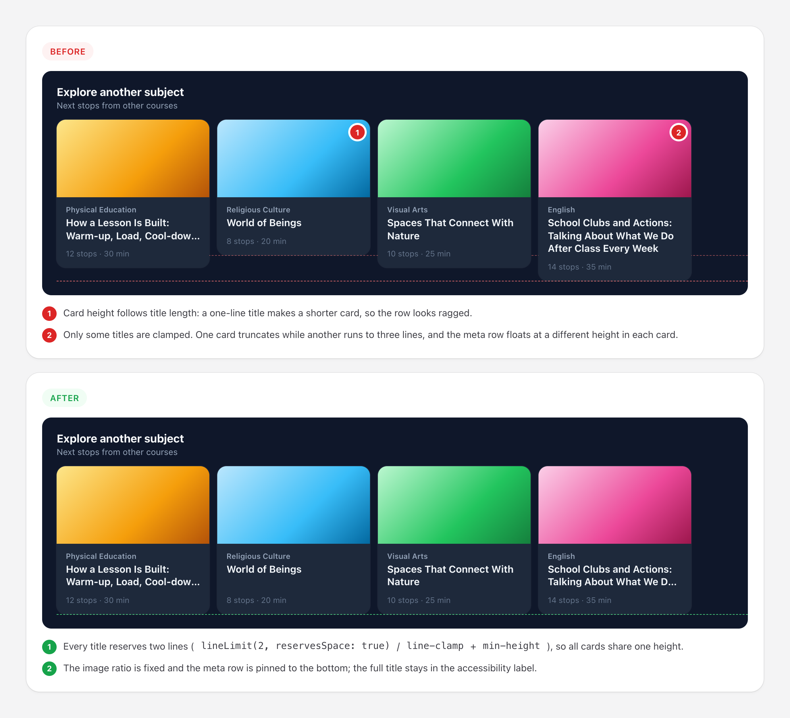
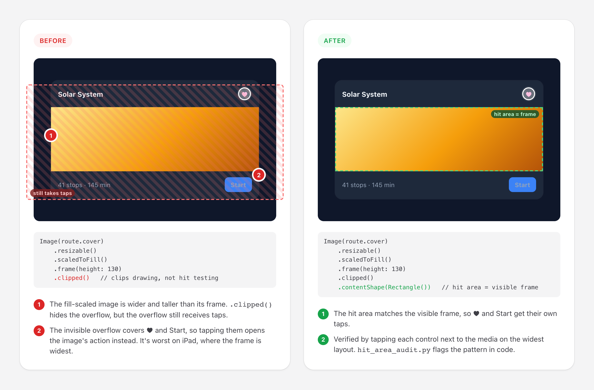
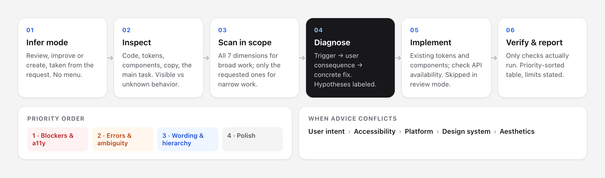

<p align="center">
  
</p>

<p align="center">
  <a href="LICENSE"></a>
  
  
  
</p>

**Interface Craft** is an [agent skill](https://docs.claude.com/en/docs/claude-code/skills) that turns your coding agent into a careful product-design reviewer. When you ask it to *"review this screen"*, *"make this form better"* or *"fix the empty states"*, it doesn't just add shadows. It checks whether the user can finish the task, understand the copy, recover from errors, and use the interface with a keyboard or screen reader. Then it polishes the details, using your existing design system.

It combines five bodies of practice in one skill, with rules for which one wins when they conflict:

- **Nielsen's 10 usability heuristics**: status, control, error prevention, recovery
- **Laws of UX**: Fitts, Hick, Jakob, Miller, goal-gradient and others, used as decision aids rather than dogma
- **UX writing**: labels, errors, empty states, confirmations, localization
- **Accessibility**: WCAG 2.2 AA thresholds, keyboard, focus, screen readers, reduced motion
- **Visual craft**: concrete values for radius, shadows, typography and motion, inspired by [make-interfaces-feel-better](https://github.com/jakubkrehel/make-interfaces-feel-better)

The full list of principles and sources is in [Foundations: what we follow](#foundations-what-we-follow).

---

## Contents

- [Before and after](#before-and-after)
- [What the agent reports](#what-the-agent-reports)
- [How it works](#how-it-works)
- [What it pays attention to](#what-it-pays-attention-to)
- [Foundations: what we follow](#foundations-what-we-follow)
- [What it will not do](#what-it-will-not-do)
- [Install](#install)
- [Usage](#usage)
- [Theme audit](#theme-audit-catch-lightdark-bugs-before-users-do)
- [Token audit](#token-audit-find-design-system-drift)
- [Hit area audit](#hit-area-audit-taps-that-land-where-users-aim)
- [Repository layout](#repository-layout)
- [Credits and license](#credits-and-license)

---

## Before and after

These mockups show the kind of changes the skill proposes. Their HTML sources are in [`examples/`](examples).

### 1. Forms: labels, errors, pending state, targets



> **Why:** a placeholder disappears as soon as the user types. “Invalid input” gives the user nothing to act on. A button that stays tappable while a request is pending invites repeat submits. The skill fixes each of these and states the limits of its fix: disabling the button reduces duplicate taps, but only the backend can guarantee idempotency.

### 2. Destructive actions: scope, consequence, undo



> **Why:** routine “Are you sure?” dialogs teach people to click through. The skill asks what exactly will happen, names the button after the action, and uses Undo instead of a confirmation when the action can be reversed.

### 3. System states: empty is not the same as failed



> **Why:** a network error that looks like an empty account makes users think their data is gone. The skill separates *initial*, *no results*, *failed*, *loading*, *partial* and *success* states, and gives each one its own next step.

### 4. Honest, trust-sensitive copy



> **Why:** dark patterns may convert once and cost trust afterwards. The skill never adds false urgency, hidden costs or guilt-based opt-outs, and it flags them when it finds them.

### 5. Visual craft: the details on top



> **Why:** these details only matter once the basics above work, which is why polish comes last in the skill's priority order. The values (radius math, three-layer shadow, `tabular-nums`, `scale(0.96)` on press, and so on) are **starting defaults**. Your design tokens and what the rendered result looks like take precedence.

### 6. Light / dark consistency: no fixed-vs-adaptive mixes



> **Why:** the most common theme bug is a *fixed* background (`Color.white`, `#F8FAFC`, `bg-white`) paired with an *adaptive* text color that turns light in dark mode, leaving white text on a white surface. The skill checks that background and foreground come from the same theme source. It renders the screen and its overlays in **both** themes, and ships a static scanner, [`theme_audit.py`](skills/interface-craft/scripts/theme_audit.py), that flags these mixes in SwiftUI, Compose and Tailwind before users see them. See [Theme audit](#theme-audit-catch-lightdark-bugs-before-users-do) for usage and example output.

### 7. Repeated content: equal cards in rows and carousels



> **Why:** sample data with similar-length titles hides this bug until real content arrives. For carousels, grids and lists the skill renders the **shortest and longest real items side by side**, then applies reserved text lines (`lineLimit(2, reservesSpace: true)`, `line-clamp` + `min-height`, `minLines`), stretch-to-tallest rows, fixed media ratios and a bottom-pinned meta row. Truncation must not hide information: the full title stays in the accessibility label. At large text sizes, readability wins over equal heights.

### 8. Layout resilience: keyboard, large text, slow networks


> **Why:** these bugs rarely show up on the one simulator and sample data used during development. The skill checks the conditions real users hit: the smallest and largest widths, landscape and iPad, the keyboard open on every form, the largest text size, a slow network and a failed image. It names the condition behind each finding, because none of these settings show in a screenshot.

### 9. Hit areas: what you see is what you tap



> **Why:** a button that "does nothing", or a tap that opens the neighbouring card, usually means the hit area doesn't match what's drawn. In SwiftUI, `.clipped()` cuts the drawing but not the hit area, so a fill-scaled image keeps catching taps with its invisible overflow. This is worst on iPad, where the frame is widest. The skill tap-tests every control next to media on the widest layout, and [`hit_area_audit.py`](skills/interface-craft/scripts/hit_area_audit.py) flags the pattern in code.

---

## What the agent reports

For a broad review, the agent gives a short summary first and then one table sorted by priority. Here is a trimmed example of a sign-up form review:

| # | Priority | Location | Before | After | User impact |
|---|---|---|---|---|---|
| 1 | Blocker | `SignUp.tsx:42` | Submit stays enabled while pending; repeated taps send repeated requests | Disable during request, spinner + “Creating account…” | Fewer repeat submissions, visible status. *Not verified: backend idempotency, flagged for follow-up* |
| 2 | A11y | `SignUp.tsx:18` | Email field has a placeholder only | Persistent `<label>` “Email”; placeholder is an example | Label stays visible while typing; screen readers announce it |
| 3 | Error | `validation.ts:9` | “Invalid input” | “Use at least 8 characters. You have 6.” next to the field | The user knows exactly what to fix |
| 4 | Polish | `Card.tsx:7` | `rounded-xl` on the card and on the inner button with `p-2` | Card `rounded-2xl` (8 + 8), button `rounded-lg` | Nested corners look concentric |

It then lists the **checks it actually ran** (browser preview, keyboard pass, both themes, and so on) and what it could not verify. Dimensions with nothing to report are left out; the table is never padded.

---

## How it works



1. **Mode is inferred:** *review* (report only), *improve* (fix and verify) or *create* (build it right from the start). You don't pick from a menu.
2. **Scope follows the request.** A broad “review this screen” scans all seven dimensions. A narrow “only the microcopy” checks only that dimension plus whatever the change directly affects, such as a longer label still fitting.
3. **Every finding is evidence-based:** what was observed, what it costs the user, and a concrete fix. Hypotheses are labeled as hypotheses. The skill never claims conversion gains or user testing it didn't do.
4. **Fixed priority order:**
   1. Task blockers and accessibility
   2. Errors, ambiguity and decision burden
   3. Wording, hierarchy and consistency
   4. Decorative polish
5. **Conflict resolution:** `user intent > accessibility > platform conventions > existing design system > aesthetics`.
6. **Proportional verification:** narrow and wide layouts, long text and both themes for visual work; keyboard, focus, loading, error and recovery for interaction work.

---

## What it pays attention to

<table>
<tr><th>Dimension</th><th>Examples of what it looks for</th></tr>
<tr><td><b>Task flow</b></td><td>Can the user start, continue, finish and recover? Is anything essential (price, consequence, a required field) hidden behind progressive disclosure?</td></tr>
<tr><td><b>Information & decision load</b></td><td>Too many equally loud options, missing defaults, information the user must remember from a previous screen</td></tr>
<tr><td><b>Microcopy</b></td><td>Vague buttons (“OK”, “Submit”), errors without a fix, placeholder-as-label, inconsistent terms, concatenated strings that break in translation</td></tr>
<tr><td><b>Interaction</b></td><td>Hit areas that don't match what's drawn (clipped fill-scaled media, near-invisible tap catchers, full-cover overlays), targets under 44pt / 48dp, Hover-only actions, missing pressed/selected/disabled states, nested click targets, no undo, duplicate submits</td></tr>
<tr><td><b>System states</b></td><td>Empty vs no-results vs failed vs loading vs partial; success claimed before it is confirmed; lost input after an error</td></tr>
<tr><td><b>Accessibility</b></td><td>Contrast (4.5:1 text, 3:1 non-text), target size, focus order and visibility, modal focus trap and return, labels and errors linked to fields, reduced motion, screen-reader names</td></tr>
<tr><td><b>Light / dark consistency</b><br><sub>cross-cutting</sub></td><td>Fixed backgrounds with adaptive text (or the reverse), sheets and menus that stay light in dark mode, color assets without a dark variant, local color-scheme overrides, missing <code>color-scheme</code> on the web, and contrast checked separately in each theme</td></tr>
<tr><td><b>Layout resilience</b><br><sub>cross-cutting</sub></td><td>Safe areas, keyboard covering fields or actions, narrow (320px / iPhone SE) and wide (iPad, landscape, split view) layouts, clipped controls at large text sizes, extreme data, skeleton/content parity, layout shift, image fallbacks</td></tr>
<tr><td><b>Visual craft</b></td><td>Design-token drift (sprawling font sizes, off-grid spacing, one-off radii, fonts that ignore Dynamic Type); equal-height cards and reserved text lines in rows, grids and carousels; Concentric radius, layered shadows vs borders, tabular numbers, optical alignment, text wrapping, interruptible motion, <code>transition: all</code>, layout shift</td></tr>
</table>

<details>
<summary><b>Web and native platforms</b></summary>

<br>

The visual reference includes native equivalents, so the skill is useful beyond CSS:

| Technique | Web | SwiftUI | Compose |
|---|---|---|---|
| Tabular numbers | `font-variant-numeric: tabular-nums` | `.monospacedDigit()` | `fontFeatureSettings = "tnum"` |
| Press feedback | `active:scale-[0.96]` | `ButtonStyle` + `.scaleEffect` | `animateFloatAsState` |
| Hit area | pseudo-element to 40–44px | `.frame(minWidth: 44, minHeight: 44)` | `minimumInteractiveComponentSize()` |
| Reduced motion | `prefers-reduced-motion` | `accessibilityReduceMotion` | animator duration scale |

Before using newer platform APIs, the skill checks your deployment target and dependency versions, and falls back to compatible alternatives when needed.
</details>

<details>
<summary><b>Localization, including Turkish</b></summary>

<br>

The microcopy reference covers locale formatting (`₺1.234,50`), plural rules and text expansion, plus Turkish-specific pitfalls: `i/İ` and `ı/I` casing, vowel-harmony suffixes on dynamic values, and consistent *sen/siz* address. The agent keeps the interface's existing locale and replies in your language.
</details>

---

## Foundations: what we follow

The skill doesn't invent its own design theory. It builds on established, publicly documented guidance, listed below with sources. Each rule is a **decision aid**: the agent applies it only when it can point to an observed problem, and never as a checklist to fill.

### 1. Nielsen's 10 usability heuristics

Source: Jakob Nielsen, [10 Usability Heuristics for User Interface Design](https://www.nngroup.com/articles/ten-usability-heuristics/) (Nielsen Norman Group). All ten are walked on every broad review.

| # | Heuristic | What the agent checks |
|---|---|---|
| 1 | Visibility of system status | Can the user tell pending, done and failed apart? Is there feedback right after an action? |
| 2 | Match between system and the real world | Do the terms and icons use the audience's words, not internal jargon? |
| 3 | User control and freedom | Can an accidental action be cancelled, undone or exited? |
| 4 | Consistency and standards | Do equivalent controls look and behave the same, and follow platform conventions? |
| 5 | Error prevention | Which costly mistake could a safe default, constraint or inline hint prevent? |
| 6 | Recognition rather than recall | Is the information needed for a decision visible at that moment? |
| 7 | Flexibility and efficiency of use | Do frequent tasks have shortcuts without hiding the standard path? |
| 8 | Aesthetic and minimalist design | Which elements compete with the main task without helping it? |
| 9 | Help users recognize, diagnose, and recover from errors | Does every error say what went wrong and what to do next, and keep the user's input? |
| 10 | Help and documentation | Is help available right where the confusion happens? |

### 2. Laws of UX

Source: Jon Yablonski, [Laws of UX](https://lawsofux.com/). The skill covers the whole catalog. Each law is written as *symptom → fix → what not to do*, because these are hypotheses about behavior, not guarantees.

**Core principles** (used whenever they fit)

| Law | How it is applied | Guardrail |
|---|---|---|
| [Fitts's law](https://lawsofux.com/fittss-law/) | Bigger targets, more spacing, primary action close to the task | Enlarged targets must not overlap |
| [Hick's law](https://lawsofux.com/hicks-law/) | Clearer categories, ranked options, a sensible default | Don't delete useful options just to lower the count |
| [Jakob's law](https://lawsofux.com/jakobs-law/) | Follow platform and product conventions | Don't copy another product wholesale |
| [Tesler's law](https://lawsofux.com/teslers-law/) | Move derivable effort into defaults and computed values | Inferred values stay visible and editable |
| [Doherty threshold](https://lawsofux.com/doherty-threshold/) | Instant pressed state; honest pending and skeleton states | Never add artificial delay |
| [Goal-gradient effect](https://lawsofux.com/goal-gradient-effect/) | A truthful step indicator in long flows | Never fake progress |
| [Zeigarnik effect](https://lawsofux.com/zeigarnik-effect/) | Autosave drafts; a visible way to resume | No nagging or manufactured unfinished tasks |
| [Von Restorff effect](https://lawsofux.com/von-restorff-effect/) | One clearly primary action; the rest secondary | Don't highlight several things at once |
| [Peak-end rule](https://lawsofux.com/peak-end-rule/) | Clear, useful completion moments (receipt, next step) | Celebration doesn't fix a broken flow |
| [Aesthetic-usability effect](https://lawsofux.com/aesthetic-usability-effect/) | Coherent spacing, type and color | Polish can hide problems, so function is tested separately |

**Memory and cognitive load**

| Law | How it is applied |
|---|---|
| [Miller's law](https://lawsofux.com/millers-law/) | Group information and keep context visible. The skill deliberately does **not** cap menus at “7±2”. |
| [Chunking](https://lawsofux.com/chunking/) | Break long content and inputs (phone numbers, IBANs, steps) into meaningful groups |
| [Working memory](https://lawsofux.com/working-memory/) | Don't make users carry values from one screen to the next |
| [Cognitive load](https://lawsofux.com/cognitive-load/) | Remove redundant interpretation; organize around the task |

**Grouping (Gestalt)**

| Law | How it is applied |
|---|---|
| [Law of Proximity](https://lawsofux.com/law-of-proximity/) | Spacing is the first tool for showing what belongs together |
| [Law of Common Region](https://lawsofux.com/law-of-common-region/) | Containers only when spacing isn't enough; too many add clutter |
| [Law of Similarity](https://lawsofux.com/law-of-similarity/) | Same function, same style; different function, visibly different |
| [Law of Uniform Connectedness](https://lawsofux.com/law-of-uniform-connectedness/) | Connect related items visually; make sure “Delete” doesn't look grouped with “Save” |
| [Law of Prägnanz](https://lawsofux.com/law-of-pr%C3%A4gnanz/) | Prefer simple, recognizable shapes and readable visual paths |

**Applied only with a concrete fit**

| Law | When it is used / limit |
|---|---|
| [Choice overload](https://lawsofux.com/choice-overload/) | Hard comparisons → comparison tables and filters. A large set isn't automatically overwhelming. |
| [Mental model](https://lawsofux.com/mental-model/) | Surprising behavior → explain it in the user's terms and validate the assumption |
| [Selective attention](https://lawsofux.com/selective-attention/) | Put task-relevant signals near the work; don't demand attention for secondary content |
| [Serial position effect](https://lawsofux.com/serial-position-effect/) | Put key items first or last in long lists; never bury critical content |
| [Flow](https://lawsofux.com/flow/) | Fewer interruptions in sustained work, while keeping exits and important warnings |
| [Paradox of the active user](https://lawsofux.com/paradox-of-the-active-user/) | Contextual, learn-by-doing help instead of up-front tutorials |
| [Postel's law](https://lawsofux.com/postels-law/) | Accept harmless format variations; never silently reinterpret ambiguous dates, amounts or identities |
| [Occam's razor](https://lawsofux.com/occams-razor/) | Prefer the simpler adequate interaction without removing needed capability |
| [Pareto principle](https://lawsofux.com/pareto-principle/) | Prioritize tasks shown to be frequent or high-impact; never invent an 80/20 split |
| [Parkinson's law](https://lawsofux.com/parkinsons-law/) | Remove unnecessary effort; never impose artificial time pressure |
| [Cognitive bias](https://lawsofux.com/cognitive-bias/) | Name the specific bias and the observed issue; the category alone is not a design instruction |

### 3. Inspired by *make-interfaces-feel-better*

The visual-craft layer is inspired by and adapted from [**make-interfaces-feel-better**](https://github.com/jakubkrehel/make-interfaces-feel-better) by **Jakub Krehel** (MIT). These are the techniques taken from it:

| Area | Techniques |
|---|---|
| Surfaces | Concentric border radius · optical alignment of icons · layered shadows instead of borders · subtle image outlines · minimum hit area |
| Typography | `text-wrap: balance` / `pretty` · font smoothing · tabular numbers |
| Motion | Interruptible transitions · split and staggered enter animations · subtle exits · contextual icon animations · `scale(0.96)` on press · no animation on first render |
| Performance | No `transition: all` · `will-change` only when needed |

**What Interface Craft changes:** the values are **starting defaults** rather than rules, so design tokens and the rendered result win. It adds SwiftUI and Compose equivalents with OS-version checks, reduced-motion handling, a forced-colors caveat for shadow-only boundaries, and platform-specific target sizes (iOS 44pt, Android 48dp). Visual polish sits **last** in the priority order, after task, copy, states and accessibility.

### 4. WCAG 2.2 accessibility

Source: W3C, [Web Content Accessibility Guidelines 2.2](https://www.w3.org/TR/WCAG22/). Level AA is the baseline, plus the platform's own guidance (Apple HIG, Material 3).

| Check | Threshold |
|---|---|
| Text contrast | 4.5:1 (large text 3:1) |
| Non-text contrast (borders, icons, focus rings) | 3:1 |
| Target size | 24×24 CSS px minimum; 44×44 enhanced; iOS 44pt, Android 48dp |
| Focus | Always visible; not hidden by sticky UI; modals trap and return focus |
| Reflow / zoom | Works at 320px width and 200% text zoom |
| Motion | Honors reduced-motion preferences; nothing flashes more than 3 times per second |

The skill reports which accessibility checks it actually ran, and says clearly that an automated check is not a conformance certificate.

### 5. Platform color and theming guidance

Sources: [Apple HIG: Dark Mode](https://developer.apple.com/design/human-interface-guidelines/dark-mode) · [Material 3: color roles](https://m3.material.io/styles/color/roles) · [Android: dark theme](https://developer.android.com/develop/ui/views/theming/darktheme) · MDN [`color-scheme`](https://developer.mozilla.org/en-US/docs/Web/CSS/color-scheme) and [`prefers-color-scheme`](https://developer.mozilla.org/en-US/docs/Web/CSS/@media/prefers-color-scheme).

- **Pair roles:** each foreground comes from the same theme source as its background (`surface`/`onSurface`, `systemBackground`/`label`, `bg-background`/`text-foreground`). Fixed colors are only for deliberately theme-independent surfaces, and then the foreground is fixed too.
- **Every token has a dark value.** Asset color sets, `values-night`, `.dark` CSS variables.
- **Overlays count:** sheets, menus, alerts, toasts, pickers and empty/error states are rendered in both themes.
- **Contrast per theme:** WCAG thresholds apply separately in light and dark, for every state.
- **Static scan + visual check:** `scripts/theme_audit.py` finds leads, and rendering both themes confirms them. On shared simulators the previous appearance is recorded and restored.

### 6. House rules

These rules come from UX writing and ethical-design practice and are applied throughout:

- **UX writing:** buttons use a verb plus object (“Delete invoices”, not “Yes”). Errors name the problem and the fix. Labels are persistent, so no placeholder-as-label. Empty, no-results and failed states are kept distinct. Terms stay consistent across the flow. Strings are localization-safe: no concatenation, locale formats, plural rules.
- **Honest state:** never claim success before it's confirmed. Keep input after recoverable errors. Prefer undo over routine confirmation dialogs, and confirm costly irreversible actions with their scope.
- **No dark patterns:** no fake urgency or countdowns, hidden costs or renewals, guilt-based opt-outs (“confirmshaming”), fake progress, or pressure tactics.
- **Honest reporting:** only checks actually run are reported. Hypotheses are labeled. No invented conversion numbers, and an expert review is never presented as user research.
- **Repeated content:** items shown side by side share one shape. Text lines are reserved, rows stretch to the tallest item, media ratios are fixed, and the result is tested with the shortest and longest real content.
- **Real conditions:** smallest and largest widths, keyboard open, largest text size, slow network and failed images are all checked. Every finding names the device, width, text size or network condition behind it.
- **Priority order:** blockers and accessibility, then errors, ambiguity and decision load, then wording and hierarchy, then polish.
- **Conflict resolution:** `user intent > accessibility > platform conventions > existing design system > aesthetics`.

---

## What it will not do

- Fake progress, invent urgency, hide costs, or write guilt-trip opt-outs
- Replace labels with placeholders, or make actions hover-only
- Cap menus at “seven items” or delete options just to reduce the count
- Animate everything, or add a motion library just for polish
- Trade readability, discoverability, control or accessibility for decoration
- Change product claims, prices or business behavior unless that's in scope
- Claim a check it did not run, or present an expert review as user research

---

## Install

### Claude Code: plugin (recommended)

```bash
/plugin marketplace add harun-yardimci/interface-craft
/plugin install interface-craft@interface-craft
```

### Claude Code: manual

```bash
git clone https://github.com/harun-yardimci/interface-craft.git
cp -R interface-craft/skills/interface-craft ~/.claude/skills/
```

To install it for a single project, copy it to `.claude/skills/` in that repo instead.

### OpenAI Codex

```bash
git clone https://github.com/harun-yardimci/interface-craft.git
cp -R interface-craft/skills/interface-craft ~/.agents/skills/
```

For a single project, use `.agents/skills/`. The optional `agents/openai.yaml` sets the display name and default prompt in the Codex UI.

### Claude apps

Download `interface-craft.zip` from the [latest release](https://github.com/harun-yardimci/interface-craft/releases/latest) and upload it under **Settings → Capabilities → Skills**.

---

## Usage

The skill triggers automatically on broad interface requests. You can also call it directly:

```text
/interface-craft review the checkout flow in app/checkout, review only
/interface-craft improve the onboarding screens, keep the layout
/interface-craft only fix the error and empty states on the invoices page
/interface-craft audit dark mode / light mode consistency in apps/ios
/interface-craft check the onboarding on iPhone SE with the keyboard open and at the largest text size
/interface-craft why do our screens feel inconsistent? run the token audit on src/
/interface-craft the favorite button on the Discover cards does nothing on iPad
Bu ekranı incele, önce/sonra tablo ile raporla
```

For narrow tasks it steps aside when a more specific skill is installed. For example, it defers to a dedicated UX-writing skill for copy-only work or an accessibility-audit skill for a WCAG audit. When no such skill is installed, it handles the task with only the relevant reference.

---

## Theme audit: catch light/dark bugs before users do

The skill includes a dependency-free static scanner for the most common theme bug: a **fixed** background next to an **adaptive** foreground. The agent runs it automatically during reviews, and you can also run it yourself or in CI:

```bash
python3 skills/interface-craft/scripts/theme_audit.py path/to/your/app
```

The scanner flags code like this, which looks fine in light mode and turns into white-on-white text in dark mode:

```swift
ScrollView { /* chips */ }
    .background(Color(hex: "F8FAFC"))          // fixed: stays light in dark mode

Text(title)
    .foregroundStyle(isSelected ? .white : Theme.ink)   // adaptive: turns light in dark mode
    .background(
        isSelected ? Theme.cobalt : Color.white,        // fixed
        in: RoundedRectangle(cornerRadius: 10)
    )
```

```html
<div class="bg-white text-foreground">…</div>   <!-- fixed bg + theme text token -->
```

Example output:

```text
[HIGH] asset-no-dark      A.xcassets/Brand.colorset
       Color set has no Dark appearance
[HIGH] mix                FilterSheet.swift:4
       Fixed background next to adaptive foreground (isSelected ? .white : Theme.ink): text likely vanishes in one theme
       > .background(Color(hex: "F8FAFC"))
[HIGH] mix                FilterSheet.swift:9
       Fixed background next to adaptive foreground (isSelected ? .white : Theme.ink): text likely vanishes in one theme
       > .background( isSelected ? Theme.cobalt : Color.white, in: RoundedRectangle(cornerRadius: 10) )
[HIGH] tw-mix             web/Card.tsx:1
       Fixed Tailwind background with a theme text token: text likely vanishes in one theme
       > <div class="bg-white text-foreground p-4">x</div>
[WARN] fixed-bg           BrandButton.swift:3
       Opaque fixed background; its foreground must be fixed too, or use an adaptive surface token
[WARN] web-no-color-scheme .
       No `color-scheme` declaration found: native inputs and scrollbars may stay light in dark mode
```

The fix is to take the background and foreground from the same theme source:

```swift
.background(Theme.surface)                                          // adaptive
.background(isSelected ? Theme.cobalt : Theme.chip, in: ...)        // adaptive
```

| Rule | Severity | What it catches |
|---|---|---|
| `mix` | high | SwiftUI: an opaque fixed background (`Color.white`, `Color(hex:)`, `.black`) within a few lines of an adaptive foreground (`.primary`, `.secondary`, project tokens); multi-line modifiers included |
| `tw-mix` | high | Tailwind: `bg-white` / `bg-zinc-100`… on the same element as a theme text token (`text-foreground`, `text-muted-foreground`) |
| `asset-no-dark` | high | Xcode color sets with no Dark appearance |
| `fixed-bg` | warn | Opaque fixed backgrounds, which are fine for brand surfaces when the foreground is fixed too |
| `scheme-override` | warn | `.preferredColorScheme`, `.environment(\.colorScheme, .light)`, `overrideUserInterfaceStyle`, forced Compose themes |
| `tw-no-dark` | warn | Fixed Tailwind colors without a `dark:` variant |
| `android-no-night` · `web-no-color-scheme` | warn | Missing `values-night/` resources; missing CSS `color-scheme` |
| `fixed-stroke` · `inline-color` · `fixed-color` (CSS) | info | Literal border or inline colors that bypass theme tokens |

Scrims and shadows (`Color.black.opacity(0.4)`, `.shadow(color: .black…)`) are intentionally ignored. Treat hits as **leads, not verdicts**: the agent confirms each one by rendering the screen, including its sheets, menus and every chip state, in both themes. Compose detection is file-level for now, so expect more false positives there than in SwiftUI or Tailwind.

---

## Token audit: find design-system drift

A second scanner, [`token_audit.py`](skills/interface-craft/scripts/token_audit.py), explains the vague feeling that screens "don't quite match". It collects every literal font size, spacing value and corner radius in SwiftUI, Compose, CSS and Tailwind, and reports how far the code has drifted from a real scale:

```bash
python3 skills/interface-craft/scripts/token_audit.py path/to/your/app            # 4pt grid
python3 skills/interface-craft/scripts/token_audit.py path/to/your/app --grid 2   # half-step systems
```

Example output:

```text
font       4 distinct literal values
         11.5×1, 13×1, 15×2, 17×1

spacing    5 distinct literal values
         6×1, 8×1, 13×2, 14×1, 16×2

radius     5 distinct literal values
         7×1, 9×1, 10×1, 12×1, 14×1

[WARN] fixed-font  3 × `.system(size:)` does not scale with Dynamic Type. Use text styles (.body, .headline) or a scaled custom font.
       Card.swift:4  > Text("Title").font(.system(size: 17, weight: .semibold))
[WARN] off-grid    3 spacing values not on the 4pt grid
       Card.tsx:1  13  > <div class="p-[13px] text-[15px] rounded-[7px] gap-4">x</div>
       Card.swift:9  14  > .padding(14)
[INFO] one-off values (used once; likely drift from the scale):
       radius      7  Card.tsx:1
       radius      9  styles.css:2
```

The agent maps each literal to the project's **existing** tokens and text styles rather than inventing new ones. A healthy scale is small, typically ~6–8 text styles, ~6–10 spacing steps and ~3–5 radii. CSS custom-property definitions such as `--space-3: 12px` are treated as tokens and skipped.

---

## Hit area audit: taps that land where users aim

The third scanner, [`hit_area_audit.py`](skills/interface-craft/scripts/hit_area_audit.py), looks for places where the tappable area differs from what the user sees:

```bash
python3 skills/interface-craft/scripts/hit_area_audit.py path/to/your/app
```

```text
[HIGH] clip-overflow  Card.swift:8
       Clipped fill/offset content without .contentShape: the overflow still takes taps and can cover nearby controls
       > .clipped()
[WARN] small-target   Card.swift:11
       Tappable label is 24x24 pt: pad to 44x44 or add .contentShape on a larger frame
       > .frame(width: 24, height: 24)
[WARN] small-target   Card.swift:15
       Tappable label is 120x28 pt: pad to 44x44 or add .contentShape on a larger frame
       > Text("Short").frame(width: 120, height: 28)
[INFO] tap-catcher    Card.swift:18
       Near-invisible layer with a tap handler: make sure it is intentional and does not cover other controls
       > Rectangle().fill(.white.opacity(0.001)).onTapGesture { }
```

| Rule | Severity | What it catches |
|---|---|---|
| `clip-overflow` | high | SwiftUI: `.scaledToFill()` / `contentMode: .fill` / offset or scaled content, then `.clipped()` or `.clipShape()`, with no `.contentShape(...)`. The invisible overflow still takes taps. |
| `small-target` | warn | SwiftUI tappable labels under 44 pt in **either** dimension, unless a larger hit area is added afterwards (`.padding(...)` + `.contentShape(...)`, or `.frame(minWidth: 44, minHeight: 44)`). `.contentShape` on the small frame alone doesn't count, because it doesn't enlarge the hit area. Compose clickables under 48 dp without `minimumInteractiveComponentSize()`. |
| `tap-catcher` | info | Near-invisible layers with a tap handler (`.opacity(0.001)`, `Color.clear` + `.contentShape`). SwiftUI doesn't hit-test views at exactly `.opacity(0)`, so near-zero opacity is how a layer silently catches taps. |
| `overlay-hit` | info | Web: `position: absolute/fixed` + `inset: 0` (or Tailwind `absolute inset-0`) layers without `pointer-events: none`. |

Static scanning can't see runtime frames, so the agent confirms every hit by tapping each control next to media and just outside each card's edge, on the **widest** layout. For a debug view of the real frames, add `.border(.red)` in SwiftUI or use the DevTools element picker on the web.

---

## Repository layout

```text
skills/interface-craft/
├── SKILL.md                         # workflow, routing, hard rules, output format
├── agents/openai.yaml               # optional Codex UI metadata
└── references/                      # loaded only when the task needs them
    ├── interaction-and-feedback.md  # Nielsen's 10 heuristics, flows, states, recovery
    ├── cognitive-principles.md      # Laws of UX as decision aids
    ├── microcopy.md                 # patterns, before → after, localization
    ├── accessibility.md             # WCAG 2.2 AA thresholds and checks
    ├── theming.md                   # light/dark consistency: pairing rules, patterns, audit
    ├── layout-resilience.md         # safe areas, keyboard, sizes, large text, loading & media
    └── visual-craft.md              # concrete values + SwiftUI/Compose equivalents
skills/interface-craft/scripts/
├── theme_audit.py                   # static scan for fixed-vs-adaptive color mixes
├── token_audit.py                   # static scan for font/spacing/radius drift
└── hit_area_audit.py                # static scan for hit areas that differ from what's drawn
.claude-plugin/                      # Claude Code plugin + marketplace manifests
examples/                            # HTML sources of the README mockups
assets/                              # rendered images
```

The skill uses progressive disclosure: `SKILL.md` stays small, and each reference file is loaded only when the task needs it.

---

## Contributing

Issues and PRs are welcome, especially:

- **Real before/after cases** where the skill helped, or where it got something wrong
- **Platform coverage**: Flutter, React Native, UIKit specifics
- **Localization notes** for other languages

Please keep additions evidence-based and concrete. A new rule should name the problem it solves and its limits.

---

## Credits and license

- Inspired by [**make-interfaces-feel-better**](https://github.com/jakubkrehel/make-interfaces-feel-better) by Jakub Krehel (MIT); the visual-craft values are adapted from it. See [NOTICE](NOTICE).
- Heuristics: Jakob Nielsen, [10 Usability Heuristics for User Interface Design](https://www.nngroup.com/articles/ten-usability-heuristics/). Only the heuristic names are used; the guidance is original.
- Laws of UX: Jon Yablonski, [lawsofux.com](https://lawsofux.com/). Principle names link to the source; the guidance is original.
- Accessibility thresholds reference [WCAG 2.2](https://www.w3.org/TR/WCAG22/).

Released under the [MIT License](LICENSE) © 2026 Harun Yardimci.
